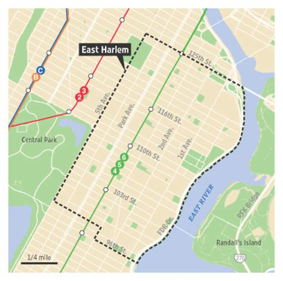
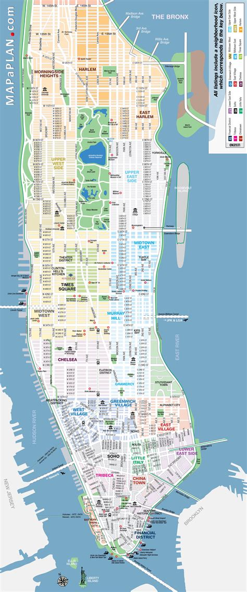
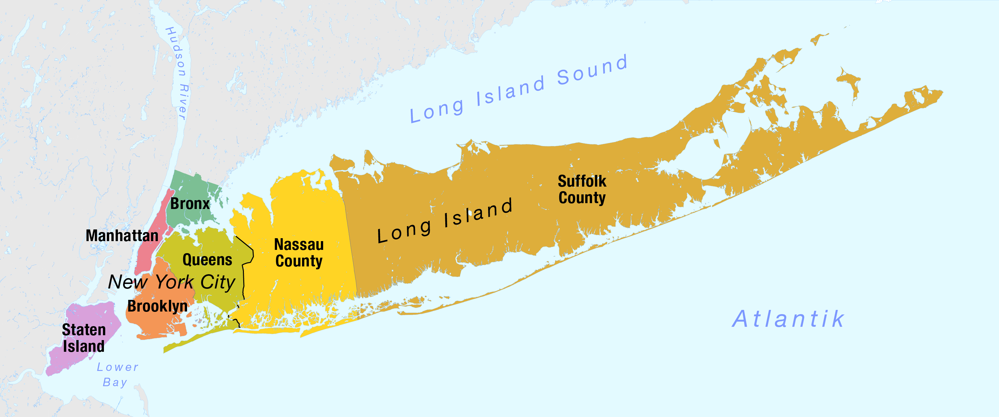
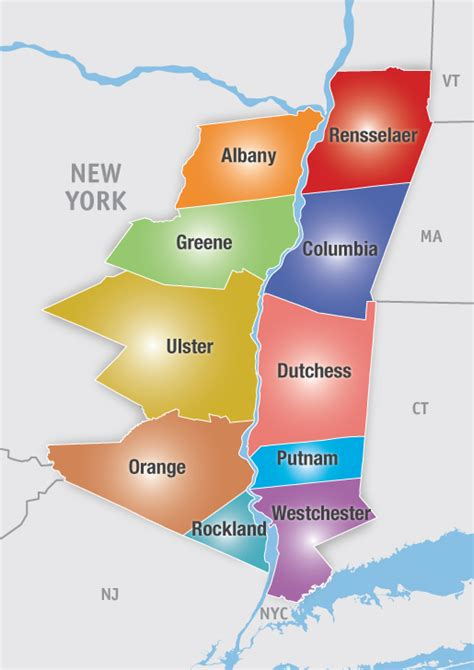

```{r include=FALSE}
library(shiny)
library(leaflet) # devtools::install_github('rstudio/leaflet')
library(highcharter) # devtools::install_github('jbkunst/highcharter')
library(plotly) # devtools::install_github('ropensci/plotly')
library(ggplot2) # devtools::install_github('hadley/ggplot2')
library(sp)
library(dplyr)
library(flexdashboard) # devtools::install_github('rstudio/flexdashboard')
library(rgeos)
library(mapproj)
library(maptools)
library(readr)
library(ggthemes)
library(tigris)
library (png)
library(readr)
library(tidyverse)
library(lubridate)
library(plotly)
library(scales)
library(miniUI)
library(sf)

# Read in data
wildfires <- read_csv("../FW_Veg_Rem_Combined.csv")
wildfires$disc_clean_date <- as.Date(wildfires$disc_clean_date, format = "%m/%d/%Y")
states <- states(cb = TRUE)
map <- reactive({
  m <- states %>%
    filter(STUSPS == input$variable)
  return(m)
})

# Filter only the wildfires that are bigger than 1000 acres
big_wildfires <- wildfires %>% 
  filter(fire_size_class == "F" | fire_size_class == "G")

```


States
=======================================================================

Sidebar {.sidebar}
----------------------------------------------------------------------

```{r}
#Define inputs for Drop Down Menu
 selectInput( "variable", "Select a State:",
              c("Alabama" = "AL",
              "Alaska" = "AK",
              "Arizona" = "AZ",
              "Arkansas" = "AR",
              "California" = "CA",
              "Colorado" = "CO",
              "Connecticut" = "CT",
              "Delaware" = "DE",
              "Florida" = "FL",
              "Georgia" = "GA",
              "Hawaii" = "HI",
              "Idaho" = "ID",
              "Illiois" = "IL",
              "Indiana" = "IN",
              "Iowa" = "IA",
              "Kansas" = "KS",
              "Kentucky" = "KY",
              "Louisiana" = "LA",
              "Maine" = "ME",
              "Maryland" = "MD",
              "Massachusetts" = "MA",
              "Michigan" = "MI",
              "Minnesota" = "MN",
              "Mississippi" = "MS",
              "Missouri" = "MO",
              "Montana" = "MT",
              "Nebraska" = "NE",
              "Nevada" = "NV",
              "New Hampshire" = "NH",
              "New Jersey" = "NJ",
              "New Mexico" = "NM",
              "New York" = "NY",
              "North Carolina" = "NC",
              "North Dakota" = "ND",
              "Ohio" = "OH",
              "Oklahoma" = "OK",
              "Oregon" = "OR",
              "Pennsylvania" = "PA",
              "Puerto Rico" = "PR",
              "Rhode Island" = "RI",
              "South Carolina" = "SC",
              "South Dakota" = "SD",
              "Tennessee" = "TN",
              "Texas" = "TX",
              "Utah" = "UT",
              "Vermont" = "VT",
              "Arkansas" = "AR",
              "Virginia" = "VA",
              "Washington" = "WA",
              "West Virginia" = "WV",
              "Wisconsin" = "WI",
              "Wyoming" = "WY"))
```

### Introduction

In recent years there has been an increase in the number of wildfires in the United States. Wildfires have an immediate and long-term impact on people's lives as they can easily displace people from their home and also release large quantities of carbon dioxide, carbon monoxide and fine particulate matter into the atmosphere. This increase in air pollution causes health issues such as exacerbating pre-existing conditions and creating respiratory issues. Many organizations project an increase in wildfires as early as 2060 in the U.S. The time is now to learn about wild fires, what human-activity causes them and what places see the most wildfires.

This ShinyApp allows users to interact with a sample of U.S. wildfires from 1992-2015. 

Row
-----------------------------------------------------------------------

### Fire Distribution

Click on a pop-up to learn more about the fire classifcation and causes. 

```{r}
#Insert Code for US Fire Distribution Map Here
# Draw the map without selected tracts


iconsL <- reactive({
  iconsL <- makeAwesomeIcon(
  icon = 'flame',
  iconColor = 'black',
  library = 'ion',
  markerColor = "red"
)
})

iconsM <- reactive({
  iconsM <- makeAwesomeIcon(
  icon = 'flame',
  iconColor = 'black',
  library = 'ion',
  markerColor = "orange"
)
})

iconsS <- reactive({
  iconsS <- makeAwesomeIcon(
  icon = 'flame',
  iconColor = 'black',
  library = 'ion',
  markerColor = "blue"
)
})

firesL <- reactive({
  firesL <- wildfires %>%
    filter(state == input$variable) %>%
    filter(fire_size_class == "F" | fire_size_class == "G")
  return(firesL)
})

firesM <- reactive({
  firesM <- wildfires %>%
    filter(state == input$variable) %>%
    filter(fire_size_class == "D" | fire_size_class == "E")
  return(firesM)
})

firesS <- reactive({
  firesS <- wildfires %>%
    filter(state == input$variable) %>%
    filter(fire_size_class == "B" | fire_size_class == "C")
  return(firesS)
})
output$map <- renderLeaflet({
    
    leaflet_map <- leaflet(map()) %>%
      addProviderTiles('CartoDB.Positron') %>%
      addPolygons(fillColor = "white",
              color = "black",
              weight = 0.5) %>%
  setView(-98.5795, 39.8282, zoom=3) %>%
  addTiles() %>%
      addAwesomeMarkers(~firesL()$longitude, ~firesL()$latitude, icon = iconsL(), 
                  popup = paste("Cause:", firesL()$stat_cause_descr, "<br>",
                           "Size:", firesL()$fire_size, "acres", "<br>",
                           "Date Discovered:", firesL()$disc_clean_date), group = "Large") %>%
  addAwesomeMarkers(~firesM()$longitude, ~firesM()$latitude, icon = iconsM(), 
                  popup = paste("Cause:", firesM()$stat_cause_descr, "<br>",
                           "Size:", firesM()$fire_size, "acres", "<br>",
                           "Date Discovered:", firesM()$disc_clean_date), group = "Medium") %>%
    addAwesomeMarkers(~firesS()$longitude, ~firesS()$latitude, icon = iconsS(), 
                  popup = paste("Cause:", firesS()$stat_cause_descr, "<br>",
                           "Size:", firesS()$fire_size, "acres", "<br>",
                           "Date Discovered:", firesS()$disc_clean_date), group = "Small") %>%
  addLayersControl(overlayGroups = c("Large (Red)", "Medium (Orange)", "Small (Blue)"), options = layersControlOptions(collapsed = FALSE))
    
    leaflet_map
    
  })
leafletOutput('map')  

```


<!-- ### Fire Size by Census Tract -->
<!-- ```{r} -->
<!-- #Insert Code for US Fire Size by Census Tract Map Here -->
<!-- ``` -->

Data Visualizations
=======================================================================

Sidebar {.sidebar}
----------------------------------------------------------------------

**Total Number of Fires Recorded Each Year, 1992-2015 vs. Numer of Fires >1000 Acres Recorded Each Year, 1992-2015**

In this side by side graph, we observe the total number of fires that occurred each year compared against the total number of fires exceeding 1000 acres for each year. In both graphs, we observe a positive linear trend, which indicates that over time the number of fires is increasing. This is not surprising as climate change has affected weather patterns and devastating wildfires have been a common occurrence, particularly in warmer climates such as California. The increase and decrease in the number of fires exceeding 1000 acres could be explained by vegetation regrowth. It would make sense that for some years large amounts of acreage is burned as there is readily available vegetation to burn. For succeeding years, there will likely be less amounts of acreages burned as the vegetation has not yet had a change to regrow. This cyclical relationship is observed in the graph on the right. 


**Acreage Burned Per Year, 1992-2015**
In this graph, we observe an overall increase in the amount of acreage burned per year. However, this relationship is not consistently increasing. As aforementioned, this makes sense, as it takes time for large amounts of burned vegetation to regrow and provide fuel for new fires. It is remarkable that in the years succeeding 2005, significant amounts of vegetation area burned (>7.5 million acres). For reference, 7.5 million acres is comparable to double the area of Hudson Valley (see “What is an acre?” for a better visual representation). 


**Average Size of Fire, by Supposed Cause, 1992-2015**
This visualization provides insight into the causes of fires. As illustrated, a fire that burns an area the size of Manhattan (10,000 acres) is caused by lightning. This is remarkable and frustrating for concerned citizens and state officials alike, as lightning strikes are not easily predictable. The unpredictable nature of larger fires could incentivize preventative measures, such as controlled fires, so as to reduce the detrimental effects of fires caused by lightning. Powerlines and campfires burn on average an area the size of East Harlem (2,500 acres). Whether or not these sources are preventable is context-dependent. Oftentimes powerlines fall as a result of a storm or other extreme weather events. In this way, powerlines are also an unpredictable cause. However, campfires could be forbidden in the warmer months, when we expect to see a surge in wildfires. This could decrease the number of wildfires occurring in warmer months. 


Row {.tabset .tabset-fade}
-----------------------------------------------------------------------

### Number of Fires


```{r}
# Number of Fires Each Year

output$num_fires_yr <- renderPlotly({ 
  discovery_year <- wildfires %>% 
  group_by(year(disc_clean_date)) %>% 
  count(year(disc_clean_date))

num_year_plot <- ggplot(discovery_year, aes(x = `year(disc_clean_date)`, y = n)) +
  geom_line() +
  labs(title = "Total Number of Fires Recorded Each Year, 1992-2015", x = "Year", y = "Number of Fires") +
  geom_smooth(method = "lm", se = F)

num_fire_plot <- ggplotly(num_year_plot) })

# plotlyOutput("num_fires_yr")

```

```{r}
# Number of Large Fires Each Year


output$lrg_fire_yr <- renderPlotly({big_discovery_year <- big_wildfires %>% 
  group_by(year(disc_clean_date)) %>% 
  count(year(disc_clean_date))

big_num_year_plot <- ggplot(big_discovery_year, aes(x = `year(disc_clean_date)`, y = n)) +
  geom_line() +
  labs(title = "Number of Fires >1000 Acres Recorded Each Year, 1992-2015", x = "Year", y = "Number of Fires") +
  geom_smooth(method = "lm", se = F)
large_fire <- ggplotly(big_num_year_plot)
})

# plotlyOutput("lrg_fire_yr")
```


```{r}
miniContentPanel(
  splitLayout(cellWidths = c("50%"), plotlyOutput("num_fires_yr"), plotlyOutput("lrg_fire_yr")),height=1000,
  scrollable = TRUE)


```

```

### Acreage Burned 

```{r}
# Acreage Burned Per Year
output$acrg_burn_plot <- renderPlotly({
  
  acreage_year <- wildfires %>% 
  group_by(year(disc_clean_date)) %>% 
  summarize(fire_size = sum(fire_size))

acreage_year_plot <- ggplot(acreage_year, aes(x = `year(disc_clean_date)`, y = fire_size)) +
  geom_line() +
  geom_smooth(method = "lm", se = F) +
  scale_y_continuous(label = number_format(big.mark = "")) +
  labs(title = "Acreage Burned Per Year, 1992-2015", x = "Year", y = "Number of Acres Burned") 
acrg_plot <-ggplotly(acreage_year_plot) })

plotlyOutput("acrg_burn_plot")
```


-----------------------------------------------------------------------
### Average Fire Size

```{r}
#Insert code for data viz #1
output$avg_fire_size <- renderPlotly({
  average_size_year <- wildfires %>% 
  group_by(year(disc_clean_date)) %>% 
  summarize(mean_size = mean(fire_size))

average_size_plot <- ggplot(average_size_year, aes(x = `year(disc_clean_date)`, y = mean_size)) +
  geom_line() +
  geom_smooth(method = "lm", se = F) +
  labs(title = "Average Size of Fire Each Year, 1992-2015", x = "Year", y = "Average Size of Fire (in Acres)")
  
 avg_fire_size_plot <- ggplotly(average_size_plot) }) 

plotlyOutput('avg_fire_size', width = "80%")
```

### Fire Causes
```{r}
# Cause vs. Average Size of Fire
output$fire_cause <- renderPlotly({
mean_size_cause <- wildfires %>% 
  group_by(stat_cause_descr) %>% 
  summarize(average_size = mean(fire_size))

mean_size_cause_plot <- ggplot(mean_size_cause, aes(x = reorder(stat_cause_descr, -average_size), y = average_size)) +
  geom_col() +
  theme(axis.text.x = element_text(angle = 90)) +
  labs(title = "Average Size of Fire, by Supposed Cause, 1992-2015", x = "Supposed Cause of Fire", y = "Average Size of Fire (in Acres)")
fire_cause_plot <- ggplotly(mean_size_cause_plot)
})

plotlyOutput("fire_cause", width = "80%", height ="80%")
```

What is an Acre? 
=======================================================================

Row {.tabset .tabset-fade}
-------------------------------------
### **5 acres**

**Fire Class B**

One city block is about **5 acres**

 

### **15 acres**

**Fire Class C**

Ground Zero 

(where the Twin Towers used to be)

was **14.6 acres** 

 

### **150 acres** 

**Fire Class D** 

Roosevelt Island is 

a little less than **150 acres**

 

### **850 acres**

**Fire Class E** 

Central Park is 

**842.6 acres** 

 

### **3,000 acres** 

**Fire Class F** 

East Harlem, New York

is a little less than **3,000 acres**

 

### **10,000 acres**

**Fire Class G**

The borough of Manhattan is a little over **10,000 acres** large



### **900,000 acres**
Long Island is a little under **900,000 acres**


### **4.5 million acres**
Hudson Valley is spans a little over **4.5 million acres**


About
=======================================================================

**Notes:**

* This sample and accompanying visualizations do not include any fires that are class A (<0.25 acres)

**Original Dataset**

* https://www.kaggle.com/capcloudcoder/us-wildfire-data-plus-other-attributes?select=Wildfire_att_description.txt


